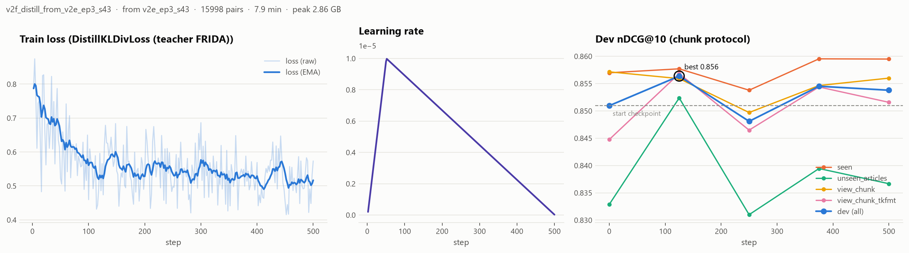

# ru-law-retrieval

[](https://github.com/alekseevpavel04/ru-law-retrieval/actions/workflows/ci.yml)

Бенчмарк поиска по законам РФ и маленькая модель эмбеддингов, дообученная до уровня модели в 4.8 раза больше.

**Вопрос.** Насколько дешёвое доменное дообучение — минуты на одной RTX 3070 — приближает маленький энкодер к большим моделям в поиске статей законов РФ, и где оно перестаёт работать?

**Ответ.** 19 минут обучения `multilingual-e5-small` (118M) поднимают nDCG@10 на тесте с 0.802 до **0.859**. Это ровно уровень `multilingual-e5-large` (560M, 0.859) при задержке на CPU в 6.8 раза меньше. Рецепт: синтетические вопросы двух LLM, разметка обучающих пар моделью-учителем FRIDA и дистилляция её ранжирования.


| | Результат | Источник |
|---|---|---|
| Прирост к своей базе (test) | **0.802 → 0.859**, +0.057 [+0.042; +0.073] | [bootstrap.csv](results/bootstrap.csv) |
| Против e5-large (560M) | +0.001 [−0.016; +0.017]: разрыв закрыт полностью | [bootstrap.csv](results/bootstrap.csv) |
| Трудный набор по ТК (716 вопросов) | **0.710 → 0.820**, +0.109 [+0.091; +0.128] | [bootstrap.csv](results/bootstrap.csv) |
| Бытовые вопросы — там весь выигрыш | **0.569 → 0.701** | [qtypes.csv](results/figures/qtypes.csv) |
| Задержка одного запроса на CPU | 23 мс против 159 мс у e5-large | [speed.json](results/speed.json) |
| В RAG-сервисе по ТК | MRR@5 **0.688 → 0.793**, +0.105 [+0.084; +0.127] | [PR #1](https://github.com/alekseevpavel04/tk-rf-rag/pull/1) |

Опубликовано:

- **Модель:** [alekseevpavel04/multilingual-e5-small-ru-law](https://huggingface.co/alekseevpavel04/multilingual-e5-small-ru-law) — [карточка](docs/MODEL_CARD.md)
- **Датасет:** [alekseevpavel04/ru-law-retrieval](https://huggingface.co/datasets/alekseevpavel04/ru-law-retrieval), формат MTEB, сплиты train / dev / test / golden / tk_hard — [карточка](docs/DATASET_CARD.md)
- **Задача `RuLawRetrieval` для MTEB:** [PR embeddings-benchmark/mteb#5496](https://github.com/embeddings-benchmark/mteb/pull/5496) на рассмотрении — [`mteb_task/`](mteb_task/)
- **Внедрение:** [tk-rf-rag PR #1](https://github.com/alekseevpavel04/tk-rf-rag/pull/1) (смержен)
- Все решения и их причины: [`docs/DECISIONS.md`](docs/DECISIONS.md). Все числа и графики: [`results/`](results/), сводные таблицы — [`results/readme_tables.md`](results/readme_tables.md).

Попробовать модель (префиксы `query: ` / `passage: ` обязательны, как у исходной e5):

```python
from sentence_transformers import SentenceTransformer

model = SentenceTransformer("alekseevpavel04/multilingual-e5-small-ru-law")
q = model.encode(["query: меня уволили, пока я был на больничном, это законно?"], normalize_embeddings=True)
d = model.encode(["passage: Трудовой кодекс РФ, Статья 81. Расторжение трудового договора по инициативе работодателя\n...",
                  "passage: Трудовой кодекс РФ, Статья 115. Продолжительность ежегодного отпуска\n..."],
                 normalize_embeddings=True)
print(q @ d.T)   # ст. 81 уверенно первая; у исходной e5-small обе статьи почти не различаются
```

---

## Данные

**Корпус.** 3786 действующих статей шести законов с legalacts.ru (скачано 19.09.2026, редакции в `sources.json` датасета), 13 809 фрагментов.

| Роль | Кодексы | Статей |
|---|---|---:|
| обучение + тест | Трудовой, Гражданский (4 части), Жилищный, КоАП | 3563 |
| только тест | Семейный, Закон «О защите прав потребителей» | 223 |

Поиск идёт по общему корпусу всех кодексов сразу, поэтому путаница между кодексами (наём жилья в ЖК против аренды в ГК) — часть задачи. Статьи «утратила силу» и пустые исключены (82 шт.).

**Вопросы** генерируют две локальные LLM из разных семейств (llama.cpp, Q4_K_M), чтобы стиль обучающих вопросов не совпадал со стилем теста: train — Qwen3-8B (два прохода, второй просит вопросы про конкретные детали статьи), dev / test / tk_hard — YandexGPT-5-Lite-8B, и каждый оценочный вопрос дополнительно проверяет LLM-судья (Qwen3-8B); обучающие вопросы судья не проверяет, для них работают только фильтры и дедупликация.

| Сплит | Вопросов | Комментарий |
|---|---:|---|
| train | 16 785 | плюс 3159 бесплатных пар «название статьи → текст» для абляции |
| dev | 296 | только выбор чекпоинтов и гиперпараметров |
| test | 728 | срезы: `seen` 293, `unseen_articles` 218, `unseen_codes` 217 |
| golden | 174 | подмножество test с повторной разметкой и множественной релевантностью |
| tk_hard | 716 | трудный набор по ТК: только бытовые вопросы и короткие поисковые запросы |

Три стиля вопросов, поровну в каждом срезе: `everyday` — бытовая ситуация без терминов («Я купил бизнес, а там куча проблем: не всё имущество есть, и ещё долги, о которых мне не сказали. Можно ли как-то цену снизить?»), `search` — запрос из 3–7 слов («запрет на посредников при усыновлении»), `legal` — вопрос юриста («Каков порядок определения размера алиментов на нетрудоспособных совершеннолетних детей…»).

Срезы теста: `seen` (по этим статьям были обучающие вопросы, но другие), `unseen_articles` (10% статей обучающих кодексов, отложенных без обучающих вопросов), `unseen_codes` (кодексы, которых не было в обучении). Статьи dev и test не пересекаются; утечки проверяются тестами, разбиения зафиксированы один раз ([`splits_stats.json`](results/splits_stats.json)).

<details>
<summary><b>Подробнее: корпус по кодексам, golden, насколько тест «лексический»</b></summary>

Полная таблица корпуса (длины, обрезка, фрагменты): [readme_tables.md](results/readme_tables.md), исходные счётчики — [`corpus_stats.json`](results/corpus_stats.json).

**Два представления корпуса:** `article` (статья целиком, обрезка на 512 токенах одинакова для всех моделей) и `chunk` (тело фрагмента до 600 символов в границах статьи, перекрытие 90, плюс заголовок статьи в начале каждого фрагмента). В протоколе chunk score статьи равен максимуму по её фрагментам. Все метрики считаются на уровне статей. Дополнительно есть третье представление `chunk_tkfmt` — нарезка в формате RAG-сервиса (500/75, без названия кодекса): по нему проверяется, что рецепт не заточен под одну нарезку.

**Golden.** 180 тестовых вопросов (по 20 на каждую пару «срез × тип»), у каждого эталон и 5 кандидатов из выдачи BM25 и FRIDA. Разметку по просьбе автора проекта выполнил ИИ-агент (Claude Opus 5, 6 независимых экземпляров по 30 вопросов) по инструкции [`docs/GOLDEN_GUIDE.md`](docs/GOLDEN_GUIDE.md), а не юрист; интерфейс для ручной перепроверки: `python -m rlr annotate`. Итог: 15 вопросов исправлено, 6 выброшено (4 помечены разметчиком, ещё 2 из-за нерелевантного эталона, которому не нашлось замены в пуле кандидатов), в сплите осталось 174. Эталон релевантен в 173 вопросах из 174, **у 37 из 174 нашлась ещё одна релевантная статья**, это 21%. Поле `share_gold_relevant` = 0.983 в [`golden_stats.json`](results/golden_stats.json) считается по 176 вопросам, то есть до удаления последних двух; пообъектные вердикты с комментариями лежат в [`data/golden/annotations.jsonl`](data/golden/annotations.jsonl). То есть автоматическая разметка «вопрос → одна статья» неполна примерно для каждого пятого вопроса — это верхняя оценка того, насколько автотест занижает модели.

**Насколько тест «лексический»** ([`lexical_overlap.csv`](results/lexical_overlap.csv)): доля слов вопроса (после стемминга), которые есть в эталонной статье, равна 0.91 для `search`, 0.75 для `legal` и 0.28 для `everyday`. BM25 при этом заметно отстаёт от сильных dense-моделей (0.670 против 0.80–0.88), так что тест не сводится к совпадению слов.

</details>

## Результаты

Test, протокол chunk, nDCG@10 на уровне статей, 95% бутстрап-ДИ по запросам (10 000 ресэмплов). Источник: [`main_table.csv`](results/main_table.csv), полные таблицы (article, golden, per-code) — [readme_tables.md](results/readme_tables.md).


| Модель | Параметры, M | nDCG@10 [95% ДИ] | Recall@10 |
|---|---:|---:|---:|
| FRIDA | 823 | 0.878 [0.859; 0.896] | 0.964 |
| e5-large-instruct | 560 | 0.865 [0.846; 0.883] | 0.968 |
| **e5-small-ru-law** (эта работа) | 118 | **0.859** [0.840; 0.878] | 0.962 |
| e5-large | 560 | 0.859 [0.839; 0.877] | 0.959 |
| bge-m3 | 568 | 0.856 [0.836; 0.875] | 0.957 |
| USER-bge-m3 | 359 | 0.846 [0.825; 0.866] | 0.952 |
| Qwen3-Emb-0.6B | 596 | 0.843 [0.823; 0.863] | 0.953 |
| ru-en-RoSBERTa | 405 | 0.840 [0.819; 0.859] | 0.956 |
| USER2-base | 149 | 0.825 [0.804; 0.846] | 0.945 |
| e5-base | 278 | 0.822 [0.800; 0.843] | 0.934 |
| e5-small (база для дообучения) | 118 | 0.802 [0.778; 0.826] | 0.905 |
| USER-base | 124 | 0.684 [0.656; 0.710] | 0.845 |
| BM25 | | 0.670 [0.640; 0.700] | 0.776 |
| rubert-tiny2 | 29 | 0.405 [0.376; 0.434] | 0.588 |

**Значимость** (парный бутстрап, [`bootstrap.csv`](results/bootstrap.csv)). Жирным — интервалы, не содержащие ноль.

| Сравнение | Все | seen | unseen_articles | unseen_codes |
|---|---:|---:|---:|---:|
| − e5-small (своя база) | **+0.057** [+0.042; +0.073] | **+0.080** [+0.056; +0.106] | **+0.058** [+0.031; +0.086] | +0.026 [−0.000; +0.052] |
| − e5-large (560M) | +0.001 [−0.016; +0.017] | −0.001 [−0.029; +0.026] | +0.002 [−0.029; +0.033] | +0.002 [−0.027; +0.030] |
| − FRIDA (823M, лучшая по dev) | **−0.019** [−0.036; −0.002] | −0.008 [−0.035; +0.019] | −0.026 [−0.061; +0.009] | −0.027 [−0.057; +0.004] |

Результат устойчив к выбору набора и протокола: **golden** (перепроверенная разметка, множественная релевантность) 0.831 → **0.894**, +0.063 [+0.033; +0.094]; **протокол article** (статья целиком, обрезка на 512 токенах) 0.757 → **0.823**, +0.065 [+0.049; +0.082]. **Три сида** (42, 43, 44): test 0.855 ± 0.008, tk_hard 0.816 ± 0.008, golden 0.886 ± 0.013 ([`headline.json`](results/headline.json)); публикуется чекпоинт с лучшим dev (seed 43), его числа и приведены в таблицах.

## Что именно даёт дообучение


| test nDCG@10 | everyday | search | legal |
|---|---:|---:|---:|
| BM25 | 0.265 | 0.822 | 0.922 |
| e5-small | 0.569 | 0.896 | 0.939 |
| **e5-small-ru-law** | **0.701** | **0.924** | **0.952** |
| e5-large | 0.717 | 0.914 | 0.945 |
| FRIDA | 0.764 | 0.936 | 0.935 |

Вопросы с юридическими терминами почти одинаково решают все модели, даже BM25: там разбирать нечего. Вся разница между моделями, а с ней и почти весь выигрыш дообучения, сосредоточена в бытовых вопросах: модель учится переводить «меня уволили, пока я был на больничном» в «расторжение трудового договора по инициативе работодателя».

**Обобщение.** Прирост держится и на отложенных статьях, по которым обучающих вопросов не было вовсе, — значит, модель учит язык домена, а не запоминает конкретные статьи. Граница метода — новые кодексы: там интервал задевает ноль. Запаса на этом срезе и так мало, он самый лёгкий для исходной e5-small (0.837 против 0.785 на `seen`), потому что СК и ЗоЗПП тематически обособлены.

<details>
<summary><b>Подробнее: по кодексам, разбор 30 худших запросов</b></summary>

**По кодексам** (test, прирост к базовой модели, [`bootstrap.csv`](results/bootstrap.csv)): ГК **+0.086** [+0.058; +0.114] и КоАП **+0.068** [+0.035; +0.103] — значимо; ЖК +0.066 [+0.000; +0.133] — на грани; ЗоЗПП +0.033 [−0.022; +0.089], ТК +0.028 [−0.012; +0.071] и СК +0.024 [−0.007; +0.054] — интервал включает ноль. По ТК в основном тесте всего 74 вопроса, и там прирост незначим; ровно для этого собран отдельный набор `tk_hard` на 716 вопросов, где тот же прирост равен +0.109 и значим.

**Разбор ошибок.** 30 худших запросов на golden классифицировал ИИ-агент по текстам статей ([`error_analysis.csv`](results/error_analysis.csv)): соседняя статья той же главы 12, тот же кодекс и другая глава 7, другой кодекс 4, неполная разметка 3, бытовая формулировка не связана с термином 3, неоднозначный вопрос 1. Нужную область права модель находит почти всегда: в 19 случаях из 30 ошибка остаётся внутри правильного кодекса, а главная слабость — различение соседних статей одной главы. Характерные примеры:

- **Соседняя статья.** «условия управления личным фондом»: первой выдана ГК ст. 123.20-7 «Управление личным фондом», нужная ст. 123.20-5 «Условия управления личным фондом» оказалась второй.
- **Другой кодекс.** «Я брал кредит, мне звонят коллекторы и угрожают. Могут ли они так себя вести?»: слово «кредит» увело модель в ГК (ст. 324), а нужна КоАП ст. 14.57 о нарушениях при возврате просроченной задолженности.
- **Неполная разметка.** Вопрос про срок ответа на запрос по заявке: модель выдала ГК ст. 1527 «Отзыв заявки», где прямо сказано, что заявку отзывают при непредставлении материалов в срок. Это тоже правильный ответ.

Именно этот разбор задал рецепт: учитель, который лучше различает соседние статьи, размечает обучающие данные, а его ранжирование дистиллируется в маленькую модель.

</details>

## Трудный набор по ТК и внедрение в сервис

Исследование выросло из RAG-сервиса по Трудовому кодексу [tk-rf-rag](https://github.com/alekseevpavel04/tk-rf-rag). На его родном наборе (30 вопросов, из них 25 с ответом в ТК) метрики упираются в потолок: на этих 25 вопросах Recall@5 = 1.0 у всех сильных dense-моделей, и базовая e5-small там не хуже дообученной. Разницу между моделями измерить нельзя. Поэтому собран **tk_hard** — 716 вопросов только по ТК, только двух самых трудных типов (бытовые и короткие поисковые), по одному каждого типа на статью, с удалением всего, что похоже на обучающие вопросы. BM25 на нём даёт 0.480 против 0.670 на основном тесте.

| Модель | tk_hard nDCG@10 [95% ДИ] | Recall@10 |
|---|---:|---:|
| e5-large-instruct | 0.858 [0.838; 0.877] | 0.950 |
| FRIDA | 0.854 [0.834; 0.874] | 0.960 |
| USER-bge-m3 | 0.840 [0.819; 0.860] | 0.953 |
| bge-m3 | 0.839 [0.819; 0.859] | 0.953 |
| ru-en-RoSBERTa | 0.821 [0.800; 0.842] | 0.953 |
| e5-large | 0.820 [0.797; 0.842] | 0.930 |
| **e5-small-ru-law** | 0.820 [0.798; 0.841] | 0.937 |
| USER2-base | 0.792 [0.768; 0.815] | 0.922 |
| Qwen3-Emb-0.6B | 0.791 [0.767; 0.813] | 0.929 |
| e5-base | 0.760 [0.735; 0.785] | 0.899 |
| e5-small (база для дообучения) | 0.710 [0.683; 0.737] | 0.865 |
| USER-base | 0.622 [0.594; 0.649] | 0.813 |
| BM25 | 0.480 [0.448; 0.512] | 0.615 |
| rubert-tiny2 | 0.346 [0.318; 0.374] | 0.518 |

Прирост дообучения здесь вдвое больше, чем на основном тесте: **+0.109** [+0.091; +0.128]. Паритет с e5-large сохраняется, но набор трудный и для больших моделей: e5-large-instruct, FRIDA, USER-bge-m3 и bge-m3 остаются впереди на 0.019–0.038.

**В самом сервисе** (FAISS, фрагменты 500/75, ранжирование статей по 20 фрагментам) модель переключена по умолчанию, у каждой модели свой индекс, `/health` показывает активную модель:

| Набор | Метрика | e5-small | **e5-small-ru-law** |
|---|---|---:|---:|
| Родные 25 вопросов с ответом | Hit@1 / MRR@5 | 0.960 / 0.980 | **0.960 / 0.980** |
| 74 вопроса по ТК из теста | Hit@1 / MRR@5 | 0.770 / 0.857 | **0.797 / 0.859** |
| Трудный tk_hard (716) | Hit@1 / MRR@5 | 0.591 / 0.688 | **0.721 / 0.793** |

На трудном наборе MRR@5 растёт на +0.105 [+0.084; +0.127], по бытовым вопросам на +0.128; на насыщенных наборах — паритет. Генерация ответов не изменилась (ссылки на верную статью 25/25, faithfulness 1.000), отказы на вопросах без ответа стали 5/5 вместо 4/5. Замер «было/стало» делался **до** переключения модели — именно он и решает, стоит ли переключать: [pull request #1](https://github.com/alekseevpavel04/tk-rf-rag/pull/1), прогоны в `eval/finetuned/`.

## Рецепт и как он выбран

Каждый шаг выбирался по dev — среднему nDCG@10 по двум форматам фрагментов (наш 600/90 и формат сервиса 500/75). Тестовые наборы при выборе не открывались; полный журнал всех прогонов: [`recipe_selection.json`](results/recipe_selection.json), таблица — [readme_tables.md](results/readme_tables.md).

| Шаг | Что добавляли | dev | Решение |
|---|---|---:|---|
| A | учитель FRIDA размечает позитивы и негативы (данные первого прохода, 9 тыс. вопросов) | 0.8431 | точка отсчёта |
| A | + второй проход генерации, 16.8 тыс. вопросов | 0.8466 | |
| A | + отсев вопросов, чью статью учитель не видит в топ-50 (5% данных) | **0.8483** | принято |
| B | + аугментация формата фрагментов (500/75 без названия кодекса) | 0.8463 | отклонено |
| C | + дистилляция ранжирования FRIDA, температура учителя 0.05 / 0.02 | 0.8483 / **0.8506** | принято, T = 0.02 |
| E | 3 эпохи первого этапа (батч 256 → 0.8437, lr 5e-5 → 0.8522) | **0.8523** | принято |
| F | дистилляция поверх трёх эпох | **0.8551** | финал |

Числа в таблице считает dev-оценщик во время обучения (обрезка 208 токенов, как при обучении). Тот же рецепт в финальном коде оценки, где всем моделям выставлена обрезка 512: dev 0.820 у базовой модели против **0.857** у опубликованного чекпоинта ([`headline.json`](results/headline.json)).

Что сработало и почему:

- **Почему учитель, а не базовая модель.** У e5-small косинусы сжаты в узкий диапазон, поэтому правило «негатив должен быть ниже 0.95 от позитива» отбирало негатив только для 30% вопросов ([`mining_e5-small.json`](results/mining_e5-small.json)); у FRIDA шкала шире, и правило работает для 92% ([`teacher_train_llm_v12.json`](results/teacher_train_llm_v12.json)). Учитель же выбирает позитивный фрагмент внутри статьи и отбрасывает 5% вопросов, которые не связываются со своей статьёй, — это шум генерации.
- **Что дала дистилляция, кроме +0.003 на dev:** устойчивость к формату нарезки. Dev в формате сервиса вырос с 0.8465 (этап E) до 0.8527 (этап F), и отдельная аугментация формата (этап B) стала не нужна.

**Обучение.** `CachedMultipleNegativesRankingLoss` (GradCache: батч 128, в памяти мини-батч 32), bf16, таблица эмбеддингов словаря заморожена (обучается 21.6M параметров из 118M); свой батч-сэмплер, который не допускает в одном батче две строки про одну статью (иначе фрагменты «своей» статьи попадают в негативы); выбор чекпоинта по dev каждые 1/4 эпохи тем же кодом метрик, что и финальная оценка. Два этапа занимают 10.7 + 7.9 минуты на RTX 3070, пик 2.9 ГБ VRAM.



*Второй этап опубликованного чекпоинта (seed 43): лосс дистилляции, расписание lr и dev nDCG@10 по срезам каждые 1/4 эпохи. Пунктир — чекпоинт первого этапа, с которого дистилляция стартует. Фигура первого этапа: [`v2e_ep3_s43.png`](results/figures/train/v2e_ep3_s43.png).*

<details>
<summary><b>Подробнее: абляции, кривая обучения, гибрид с BM25</b></summary>

**Абляции первой серии** (E1/E2, 8 прогонов, [`ablation.csv`](results/ablation.csv)):

| Данные × негативы | dev | test |
|---|---:|---:|
| без дообучения | 0.815 | 0.802 |
| заголовки статей | 0.822–0.826 | 0.804 |
| LLM-вопросы, in-batch | 0.841 | 0.847 |
| LLM-вопросы + hard negative | 0.851 | 0.845 |
| оба источника | 0.845–0.848 | 0.839–0.845 |

Бесплатные пары «название статьи → текст» бесполезны: на тесте 0.803 против 0.802 у базовой, а при долгом обучении модель на них деградирует — запрос почти дословно совпадает с заголовком, который есть в каждом фрагменте. Hard negatives от самой e5-small давали +0.010 на dev, но на тесте эффект был в пределах шума: именно поэтому в финальном рецепте негативы майнит учитель. e5-base после дообучения не лучше e5-small (0.847 против 0.845), хотя до дообучения была лучше на 0.020.


**Кривая обучения:** 0 → 2285 → 4570 → 9139 вопросов даёт dev 0.815 → 0.832 → 0.838 → 0.851 и test 0.802 → 0.811 → 0.835 → 0.845. Плато не достигнуто — отсюда второй проход генерации.

**Гибрид BM25 + dense не помогает.** Равновесный RRF (k = 60) ухудшает обе лучшие модели: FRIDA 0.878 → 0.792, наша 0.859 → 0.777. Правильный способ — подобрать вес BM25 на dev: сетка даёт оптимум **0.0** для обеих, то есть лексическая часть не добавляет ничего. Причина видна по типам вопросов: BM25 отстаёт даже на коротких поисковых запросах (0.822 против 0.924), а на бытовых проваливается (0.265). В сервис гибрид не взят. Сетка весов сохранена в [`summary/wRRF(BM25x0+e5-small-ru-law).json`](results/summary/).

Кривые всех 32 прогонов (loss, lr, grad norm каждые 2 шага; dev по срезам и форматам каждые 1/4 эпохи) лежат в [`results/figures/train/`](results/figures/train/) и [`results/train/curves/`](results/train/curves/), сводка с временем и памятью — [`train_runs.csv`](results/train_runs.csv). Суммарно всё обучение в проекте заняло 3.6 часа GPU.

</details>

## Цена

Задержка одного запроса включает кодирование и точный поиск по 13 809 фрагментам. CPU: Ryzen 5 5600X, 6 потоков, fp32. GPU: RTX 3070, fp16. Источник: [`speed.json`](results/speed.json). Дообучение не меняет архитектуру, поэтому скорость равна скорости исходной e5-small.


| Модель | Параметры, M | dim | Индекс, МБ (fp32) | CPU p50, мс | GPU p50, мс |
|---|---:|---:|---:|---:|---:|
| **e5-small-ru-law** | 118 | 384 | 20.2 | 23.2 | 15.7 |
| e5-base | 278 | 768 | 40.5 | 41.9 | 16.2 |
| USER2-base | 149 | 768 | 40.5 | 57.9 | 27.2 |
| bge-m3 | 568 | 1024 | 53.9 | 151.7 | 26.8 |
| e5-large | 560 | 1024 | 53.9 | 158.5 | 27.7 |
| FRIDA | 823 | 1536 | 80.9 | 270.2 | 61.4 |
| Qwen3-Emb-0.6B | 596 | 1024 | 53.9 | 340.0 | 66.9 |

При равном качестве с e5-large дообученная модель в 6.8 раза быстрее на CPU, её индекс в 2.7 раза меньше, параметров в 4.8 раза меньше.

**Цена специализации.** На общем домене модель проседает: MTEB `RuBQRetrieval` (вопросы по Википедии) 0.686 → 0.659 ([`forgetting.json`](results/forgetting.json)). Дистилляция от учителя уменьшила потерю (у одноэтапного рецепта было 0.651, у дообученной e5-base — 0.632), но не убрала. Если в одном сервисе нужен и общий поиск, стоит держать исходную модель рядом или подмешивать общие пары в обучение.

## Ограничения

- **Синтетические вопросы.** Реальные вопросы длиннее, грязнее и неоднозначнее. Два генератора из разных семейств снижают риск общего «LLM-стиля», но не убирают его.
- **Неполная разметка.** Примерно у 21% вопросов больше одной релевантной статьи (оценка по golden): автотест занижает модели, которые находят другую, но тоже правильную статью.
- **Golden размечен ИИ-агентом, а не юристом.**
- **Одна редакция законов** (сентябрь 2026), статьи «утратила силу» исключены.
- **Потолок дистилляции.** Ученик наследует ошибки учителя: там, где FRIDA слаба (`unseen_codes`), прироста почти нет.
- **Разброс по сидам** на тесте (std 0.008) сравним с разницей между соседними моделями в таблице, поэтому все выводы даны с доверительными интервалами.
- **Рецепт дорабатывался после того, как первая его версия была измерена на тесте.** Все решения приняты по dev, но сам факт второго прохода по циклу «идея → dev → тест» зафиксирован в [DECISIONS.md](docs/DECISIONS.md).

## Воспроизведение

Windows 11 (скрипты `.sh` рассчитаны на Git Bash), Python 3.11, RTX 3070 8 ГБ. Всё обучение в проекте — 3.6 часа GPU.

```bash
uv venv .venv --python 3.11
uv pip install -r requirements.txt && uv pip install -e .
cp .env.example .env                                     # пути к кэшам и локальному LLM-серверу

python -m rlr download && python -m rlr parse            # корпус с legalacts.ru, ~15 мин
python -m rlr chunk                                      # фрагменты 600/90
python -m rlr chunk --view chunk_tkfmt --chunk-size 500 --overlap 75 --no-code-header
python -m rlr splits                                     # разбиения фиксируются один раз (seed 42)

scripts/run_generation.sh                                # dev/test, судья, два прохода train-вопросов, ~1.5 ч
scripts/run_dataset.sh                                   # tk_hard, сборка датасетов, майнинг, учитель FRIDA

scripts/run_ablations.sh                                 # абляции E1 / E2 / E4 и их сиды
python scripts/run_recipe.py                             # этапы A-D рецепта, выбор по dev
python scripts/run_recipe_stage_e.py && python scripts/run_recipe_stage_f.py
scripts/run_eval.sh                                      # тест, golden, tk_hard, бутстрап, RuBQ, скорость, таблицы, графики

python scripts/export_model.py models/v2f_distill_from_v2e_ep3_s43/best data/export/hf_model \
    intfloat/multilingual-e5-small                       # чекпоинт в формате, который читает и ST 3.x

python -m pytest                                         # 88 быстрых тестов (9 из них требуют собранный data/); -m slow: ещё 12 на префиксы моделей
```

Каждый шаг идемпотентен: готовые файлы и обученные чекпоинты пропускаются. Все числа итоговой оценки — таблицы, графики, бутстрап, `headline.json` — производит один скрипт `scripts/run_eval.sh`; статистику данных и журнал выбора рецепта пишут более ранние шаги.

## Структура

```
src/rlr/     пакет: data (корпус и сплиты), gen (LLM-генерация), train (учитель, сэмплер,
             обучение), eval (метрики, поиск, бутстрап, анализ), annotate (разметка golden)
scripts/     по одному скрипту на стадию пайплайна + headline.py и readme_tables.py
configs/     кодексы, baselines.yaml, конфиги обучения, пары для бутстрапа
results/     все числа и графики проекта (коммитятся), mteb_task/ — задача для MTEB
```

Лицензия кода: MIT. Лицензии данных указаны в [карточке датасета](docs/DATASET_CARD.md).
