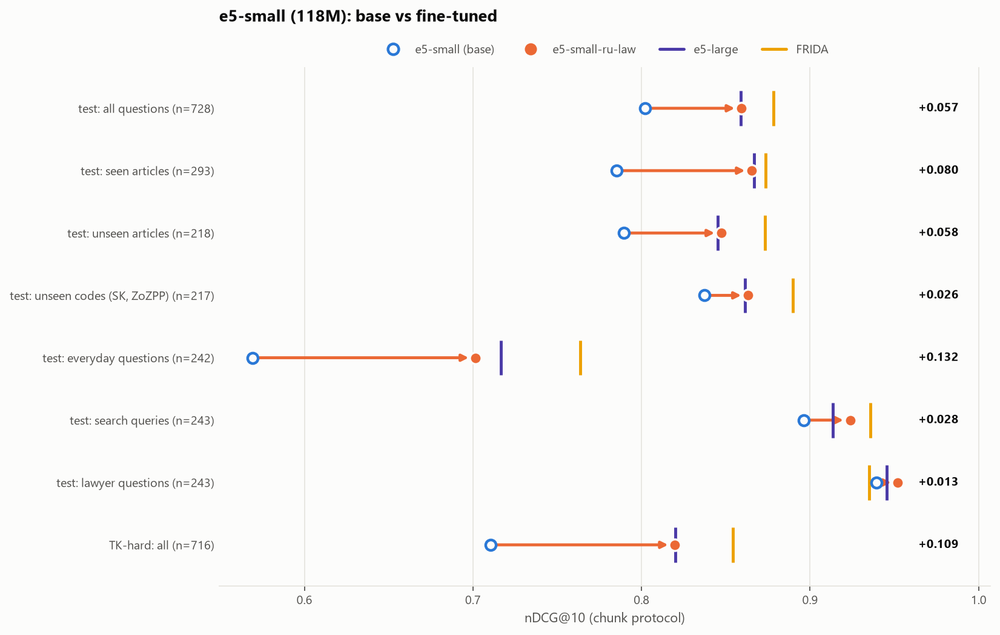
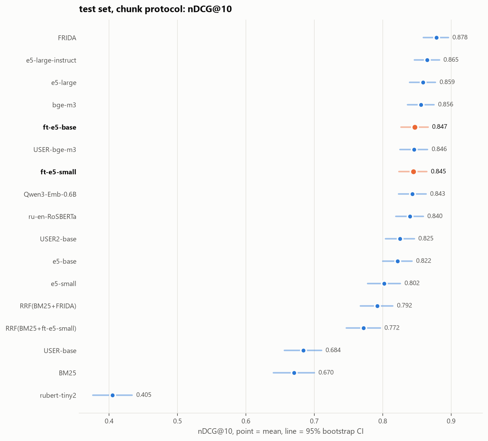
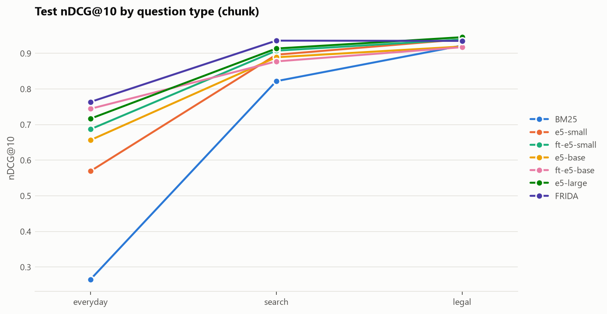
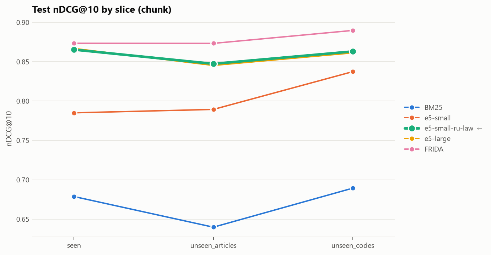
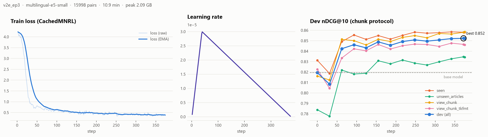
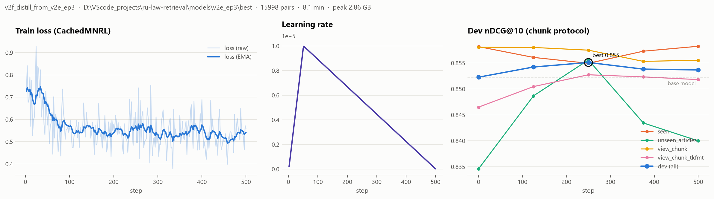
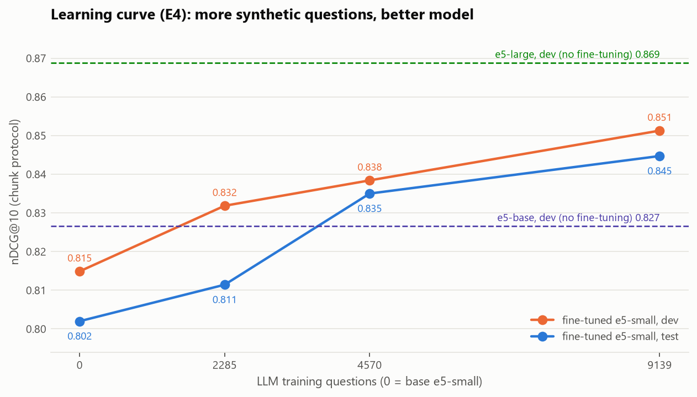
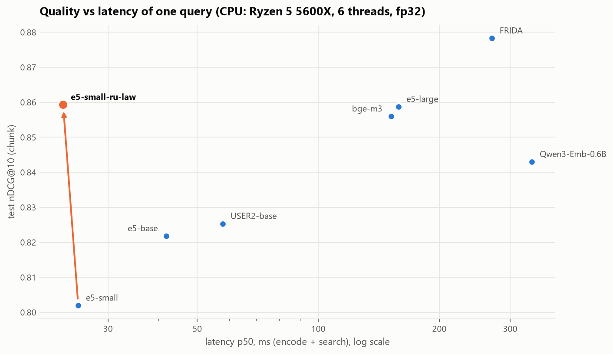

# ru-law-retrieval

Бенчмарк поиска по законам РФ и дообученная маленькая модель эмбеддингов, которая догнала модель в 4.8 раза больше.

**Вопрос исследования.** Насколько дешёвое доменное дообучение маленькой модели эмбеддингов (минуты на одной RTX 3070) приближает её к большим моделям в поиске статей законов РФ? И где это ломается: на статьях и кодексах, которых не было в обучении?

**Ответ.** 19 минут обучения `multilingual-e5-small` (118M параметров) поднимают nDCG@10 на тесте с **0.802 до 0.859** (+0.057, 95% ДИ [+0.042; +0.073]). Это ровно уровень `multilingual-e5-large` (560M, 0.859; разница +0.001 [−0.016; +0.017], модели статистически неотличимы) при задержке на CPU в 6.7 раза меньше и индексе в 2.7 раза меньше. На трудном наборе бытовых вопросов по ТК прирост ещё больше: 0.710 → **0.820** (+0.109 [+0.091; +0.128]). Рецепт: синтетические вопросы двух LLM + разметка обучающих данных моделью-учителем FRIDA + дистилляция её ранжирования.



| | Результат | Источник |
|---|---|---|
| Прирост к своей базе (test) | **+0.057** [+0.042; +0.073]; три сида 0.855 ± 0.008 | [bootstrap_published.csv](results/bootstrap_published.csv), [headline.json](results/headline.json) |
| Против e5-large (560M) | +0.001 [−0.016; +0.017]: разрыв закрыт полностью | [bootstrap_published.csv](results/bootstrap_published.csv) |
| Против лучшей модели бенчмарка (FRIDA, 823M) | −0.019 [−0.036; −0.002] | [bootstrap_published.csv](results/bootstrap_published.csv) |
| Трудный набор по ТК (716 вопросов) | **+0.109** [+0.091; +0.128], уровень e5-large | [readme_tables.md](results/readme_tables.md) |
| Статьи, которых не было в обучении | **+0.058** [+0.031; +0.087] | срез `unseen_articles` |
| Кодексы, которых не было в обучении | +0.026 [−0.000; +0.052]: почти нет | срез `unseen_codes` |
| Какие вопросы выигрывают | бытовые **0.569 → 0.701**, поисковые +0.028, юридические +0.013 | [qtypes.csv](results/figures/qtypes.csv) |
| Цена по времени | 19 мин обучения (11 + 8), пик 2.9 ГБ VRAM | [train_runs.csv](results/train_runs.csv) |
| Цена по общему домену | RuBQ 0.686 → 0.659 | [forgetting.json](results/forgetting.json) |
| В сервисе tk-rf-rag | MRR@5 0.688 → 0.793 на трудном наборе, паритет на старом | [раздел ниже](#связь-с-tk-rf-rag) |

Опубликовано:
- Датасет: [alekseevpavel04/ru-law-retrieval](https://huggingface.co/datasets/alekseevpavel04/ru-law-retrieval), формат MTEB, сплиты train / dev / test / golden / tk_hard.
- Модель: [alekseevpavel04/multilingual-e5-small-ru-law](https://huggingface.co/alekseevpavel04/multilingual-e5-small-ru-law).
- Задача для MTEB готова и проверена их же кодом, PR пока не отправлен: [`mteb_task/`](mteb_task/).
- Все решения и их причины: [`docs/DECISIONS.md`](docs/DECISIONS.md).

---

## Содержание

1. [Датасет](#датасет)
2. [Главная таблица](#главная-таблица)
3. [Трудный набор по ТК](#трудный-набор-по-тк-tk_hard)
4. [Где помогает дообучение](#где-помогает-дообучение)
5. [Как получен рецепт](#как-получен-рецепт-выбор-только-по-dev)
6. [Обучение: кривые](#обучение-кривые)
7. [Гибрид BM25 + dense](#гибрид-bm25--dense)
8. [Забывание](#забывание)
9. [Скорость и размер](#скорость-и-размер)
10. [Разбор ошибок](#разбор-ошибок)
11. [Ограничения](#ограничения)
12. [Воспроизведение](#воспроизведение)
13. [Связь с tk-rf-rag](#связь-с-tk-rf-rag)

## Датасет

**Корпус.** 3786 действующих статей шести законов, скачанных с legalacts.ru 19.09.2026, редакции указаны в `sources.json` датасета.

- **Обучающий домен:** Трудовой кодекс, Гражданский кодекс (все 4 части), Жилищный кодекс, КоАП.
- **Только тест:** Семейный кодекс и Закон «О защите прав потребителей».

Поиск идёт по общему корпусу всех кодексов сразу, так что путаница между кодексами (наём жилья в ЖК против аренды в ГК) тоже часть задачи. Статьи «утратила силу» и пустые исключены. Статистика: [`results/corpus_stats.json`](results/corpus_stats.json).

| Кодекс | Статей | Действующих | Исключено (утр. силу / пустые) | Медиана, симв. | p95, симв. | Медиана, ток. | p95, ток. | > 512 ток. | Фрагментов |
|---|---:|---:|---:|---:|---:|---:|---:|---:|---:|
| ТК (`tk`) | 540 | 534 | 6 / 0 | 1092 | 4785 | 220 | 918 | 97 | 1894 |
| ГК (`gk`) | 1731 | 1717 | 12 / 2 | 862 | 3184 | 186 | 653 | 144 | 4537 |
| ЖК (`zhk`) | 243 | 241 | 2 / 0 | 1696 | 10537 | 335 | 2027 | 78 | 1564 |
| КоАП (`koap`) | 1124 | 1071 | 53 / 0 | 1345 | 6421 | 277 | 1252 | 273 | 5127 |
| СК (`sk`) | 175 | 171 | 4 / 0 | 833 | 2758 | 180 | 604 | 11 | 401 |
| ЗоЗПП (`zozpp`) | 55 | 52 | 3 / 0 | 1704 | 5953 | 342 | 1192 | 19 | 286 |

**Два представления корпуса:** `article` (статья целиком, обрезка на 512 токенах одинакова для всех моделей) и `chunk` (фрагменты до 600 символов в границах статьи, перекрытие 90, заголовок статьи в начале каждого фрагмента). В протоколе chunk score статьи равен максимуму по её фрагментам. Все метрики и разметка считаются на уровне статей.

**Вопросы** генерируют две локальные LLM из разных семейств (llama.cpp, Q4_K_M), чтобы стиль обучающих вопросов не совпадал со стилем теста:
- **train:** Qwen3-8B, два прохода с разными промптами (второй просит вопросы про конкретные детали статьи);
- **dev / test / tk_hard:** YandexGPT-5-Lite-8B, по вопросу на статью, каждый проверяет LLM-судья (Qwen3-8B).

| Тип | Пример из теста |
|---|---|
| `everyday` | «Я купил бизнес, а там куча проблем: не всё имущество есть, и ещё долги, о которых мне не сказали. Можно ли как-то цену снизить?» |
| `search` | «запрет на посредников при усыновлении» |
| `legal` | «Каков порядок определения размера алиментов на нетрудоспособных совершеннолетних детей при отсутствии соглашения об уплате алиментов?» |

| Сплит | Вопросов | Комментарий |
|---|---:|---|
| train | 16 785 | и 3 159 бесплатных пар «название статьи → текст» для абляции |
| dev | 296 | только выбор чекпоинтов и гиперпараметров |
| test | 728 | срезы: `seen` 293, `unseen_articles` 218, `unseen_codes` 217 |
| golden | 174 | подмножество test с повторной разметкой и множественной релевантностью |
| tk_hard | 716 | трудный набор по ТК: только бытовые вопросы и поисковые запросы |

Срезы теста: `seen` (по этим статьям были обучающие вопросы, но другие), `unseen_articles` (10% статей обучающих кодексов, отложенных без обучающих вопросов), `unseen_codes` (кодексы, которых не было в обучении). Статьи dev и test не пересекаются, утечки проверяют тесты `tests/test_leaks.py`. Счётчики всех фильтров: [`results/dataset_stats.json`](results/dataset_stats.json), [`dataset_stats_train_llm_v12.json`](results/dataset_stats_train_llm_v12.json), [`dataset_stats_tk_hard.json`](results/dataset_stats_tk_hard.json).

**Golden.** 180 тестовых вопросов, по 20 на каждую пару «срез × тип», у каждого эталон и 5 кандидатов из выдачи BM25 и FRIDA. Разметку по просьбе автора проекта выполнил ИИ-агент (Claude Opus 5, 6 независимых экземпляров по 30 вопросов) по инструкции [`docs/GOLDEN_GUIDE.md`](docs/GOLDEN_GUIDE.md), а не юрист. Интерфейс для ручной перепроверки: `python -m rlr annotate`. Итог ([`results/golden_stats.json`](results/golden_stats.json)): 15 вопросов исправлено, 6 выброшено, эталон релевантен в 98.3% случаев, **у 21% вопросов нашлась ещё одна релевантная статья**. То есть синтетическая разметка «вопрос → одна статья» неполна примерно для каждого пятого вопроса.

**Насколько тест «лексический»** ([`results/lexical_overlap.csv`](results/lexical_overlap.csv)): доля слов вопроса (после стемминга), которые есть в эталонной статье, равна 0.91 для `search`, 0.75 для `legal` и 0.28 для `everyday`. BM25 при этом заметно отстаёт от dense-моделей (0.670 против 0.80-0.88), так что тест не сводится к совпадению слов.

## Главная таблица

Test, протокол chunk, nDCG@10 на уровне статей, 95% бутстрап-ДИ по запросам (10 000 ресэмплов). Жирным выделены дообученные модели. Источник: [`results/main_table.csv`](results/main_table.csv).



| Модель | Параметры, M | nDCG@10 [95% ДИ] | Recall@10 | seen | unseen_articles | unseen_codes |
|---|---:|---:|---:|---:|---:|---:|
| FRIDA | 823 | 0.878 [0.859; 0.896] | 0.964 | 0.874 | 0.873 | 0.890 |
| e5-large-instruct | 560 | 0.865 [0.846; 0.883] | 0.968 | 0.866 | 0.860 | 0.868 |
| **ft-e5-small-v2** (эта работа) | 118 | 0.859 [0.840; 0.878] | 0.962 | 0.865 | 0.847 | 0.863 |
| e5-large | 560 | 0.859 [0.839; 0.877] | 0.959 | 0.867 | 0.845 | 0.861 |
| bge-m3 | 568 | 0.856 [0.836; 0.875] | 0.957 | 0.853 | 0.845 | 0.872 |
| **ft-e5-base** (v1) | 278 | 0.847 [0.826; 0.866] | 0.953 | 0.843 | 0.858 | 0.839 |
| USER-bge-m3 | 359 | 0.846 [0.825; 0.866] | 0.952 | 0.851 | 0.831 | 0.853 |
| **ft-e5-small** (v1) | 118 | 0.845 [0.824; 0.864] | 0.948 | 0.835 | 0.845 | 0.858 |
| Qwen3-Emb-0.6B | 596 | 0.843 [0.823; 0.863] | 0.953 | 0.834 | 0.840 | 0.859 |
| ru-en-RoSBERTa | 405 | 0.840 [0.819; 0.859] | 0.956 | 0.844 | 0.837 | 0.837 |
| USER2-base | 149 | 0.825 [0.804; 0.846] | 0.945 | 0.825 | 0.815 | 0.837 |
| e5-base | 278 | 0.822 [0.800; 0.843] | 0.934 | 0.810 | 0.799 | 0.860 |
| e5-small (база для дообучения) | 118 | 0.802 [0.778; 0.826] | 0.905 | 0.785 | 0.789 | 0.837 |
| USER-base | 124 | 0.684 [0.656; 0.710] | 0.845 | 0.674 | 0.671 | 0.710 |
| BM25 | | 0.670 [0.640; 0.700] | 0.776 | 0.679 | 0.640 | 0.689 |
| rubert-tiny2 | 29 | 0.405 [0.376; 0.434] | 0.588 | 0.395 | 0.343 | 0.481 |

**Значимость** (парный бутстрап, test/chunk, [`results/bootstrap_published.csv`](results/bootstrap_published.csv)). Жирным выделены интервалы, не содержащие ноль.

| Сравнение | Все | seen | unseen_articles | unseen_codes |
|---|---:|---:|---:|---:|
| ft-e5-small-v2 − e5-small | **+0.057** [+0.042; +0.073] | **+0.080** [+0.056; +0.106] | **+0.058** [+0.031; +0.087] | +0.026 [−0.000; +0.052] |
| ft-e5-small-v2 − ft-e5-small (v1) | **+0.015** [+0.003; +0.026] | **+0.031** [+0.013; +0.049] | +0.003 [−0.017; +0.023] | +0.005 [−0.015; +0.025] |
| ft-e5-small-v2 − e5-large | +0.001 [−0.016; +0.017] | −0.001 [−0.029; +0.026] | +0.002 [−0.029; +0.033] | +0.002 [−0.027; +0.030] |
| ft-e5-small-v2 − FRIDA | **−0.019** [−0.036; −0.002] | −0.008 [−0.035; +0.019] | −0.026 [−0.061; +0.009] | −0.027 [−0.057; +0.004] |

**Три сида** (42, 43, 44), среднее ± std ([`results/headline.json`](results/headline.json)): test 0.855 ± 0.008, tk_hard 0.816 ± 0.008, golden 0.886 ± 0.013. Публикуется чекпоинт с лучшим dev (seed 43), в таблицах приведены его числа.

**Golden** (174 вопроса, множественная релевантность): 0.894 против 0.831 у базовой модели, прирост +0.063 [+0.033; +0.094]; у FRIDA 0.916. **Протокол article** (статья целиком, обрезка на 512 токенах): 0.823 против 0.757 у базовой, +0.065 [+0.049; +0.082]. Полные таблицы: [`results/readme_tables.md`](results/readme_tables.md).

## Трудный набор по ТК (tk_hard)

На родном наборе сервиса tk-rf-rag (30 вопросов) метрики упираются в потолок (Recall@5 = 1.0 у всех dense-моделей), поэтому собран отдельный трудный набор: 716 вопросов только по Трудовому кодексу, только двух самых сложных типов (бытовые и короткие поисковые), по одному на статью, с удалением всего, что похоже на обучающие вопросы. BM25 на нём даёт 0.480 против 0.670 на основном тесте.

| Модель | nDCG@10 [95% ДИ] | Recall@10 |
|---|---:|---:|
| e5-large-instruct | 0.858 [0.838; 0.877] | 0.950 |
| FRIDA | 0.854 [0.834; 0.874] | 0.960 |
| bge-m3 | 0.839 [0.819; 0.859] | 0.953 |
| **ft-e5-small-v2** | 0.820 [0.798; 0.841] | 0.937 |
| e5-large | 0.820 [0.797; 0.842] | 0.930 |
| **ft-e5-small** (v1) | 0.795 [0.772; 0.817] | 0.937 |
| e5-base | 0.760 [0.735; 0.785] | 0.899 |
| e5-small | 0.710 [0.683; 0.737] | 0.865 |
| BM25 | 0.480 [0.448; 0.512] | 0.615 |

Прирост дообучения здесь вдвое больше, чем на основном тесте: +0.109 [+0.091; +0.128] к базовой модели и +0.025 [+0.012; +0.039] к первой версии.

## Где помогает дообучение



| test nDCG@10 | everyday | search | legal |
|---|---:|---:|---:|
| BM25 | 0.265 | 0.822 | 0.922 |
| e5-small | 0.569 | 0.896 | 0.939 |
| **ft-e5-small-v2** | **0.701** | **0.924** | **0.952** |
| e5-large | 0.717 | 0.914 | 0.945 |
| FRIDA | 0.764 | 0.936 | 0.935 |

Вопросы с юридическими терминами почти одинаково решают все модели, даже BM25: там разбирать нечего. Вся разница между моделями, а с ней и почти весь выигрыш дообучения, сосредоточена в бытовых вопросах: модель учится переводить «меня уволили, пока я был на больничном» в «расторжение трудового договора по инициативе работодателя».



Срез `unseen_codes` оказался самым простым для базовых моделей (СК и ЗоЗПП тематически обособлены), поэтому расти там почти некуда, и прирост дообучения самый маленький.

## Как получен рецепт (выбор только по dev)

Первая версия (v1) обучалась на 9 тыс. вопросов одного прохода генерации, с позитивами и негативами от самой базовой e5-small. Она дала +0.043 на тесте, но проиграла базовой модели внутри сервиса tk-rf-rag: там корпус состоит из одного кодекса и другой формат фрагментов. Отсюда вторая версия.

Каждый шаг v2 выбирался по dev (среднее nDCG@10 по двум форматам фрагментов: наш 600/90 и формат tk-rf-rag 500/75), тест не открывался. Полный журнал: [`results/v2_selection.json`](results/v2_selection.json), таблица всех прогонов: [readme_tables.md](results/readme_tables.md#v2-stages).

| Шаг | Что проверяли | dev | Решение |
|---|---|---:|---|
| v1 | 9 тыс. вопросов, негативы от e5-small | 0.840 | точка отсчёта |
| A | + учитель FRIDA выбирает позитивы и негативы | 0.843 | |
| A | + второй проход генерации (16.8 тыс. вопросов) | 0.847 | |
| A | + отбрасывание вопросов, чью статью учитель не видит в топ-50 | **0.848** | принято |
| B | + аугментация формата фрагментов (500/75 без названия кодекса) | 0.846 | отклонено |
| C | + дистилляция FRIDA, температура учителя 0.05 / 0.02 | 0.848 / **0.851** | принята T = 0.02 |
| E | 3 эпохи вместо 2 (батч 256 и lr 5e-5 проиграли) | **0.852** | принято |
| F | дистилляция поверх 3 эпох | **0.855** | принято, финал |

Что сработало и почему:
- **Учитель FRIDA вместо базовой e5-small.** У e5-small косинусы сжаты (позитив 0.875, лучший чужой кандидат 0.871), поэтому правило «негатив должен быть ниже 0.95 от позитива» отбирало негативы только для 30% вопросов. У FRIDA шкала шире: правило работает для 92%. Учитель же выбирает и позитивный фрагмент внутри статьи, и отбрасывает 5% вопросов, которые не связываются со своей статьёй (шум генерации).
- **Дистилляция ранжирования** (`DistillKLDivLoss` по 8 кандидатам, оценки FRIDA): +0.003 на dev у сида 42 и стабильно +0.005…+0.008 на сидах 43/44.
- **Второй проход генерации:** кривая обучения v1 не выходила на плато, и ещё 7.6 тыс. вопросов дали +0.004 на dev.
- **Аугментация формата не понадобилась:** учитель и так сделал модель устойчивой к формату фрагментов, dev в формате tk-rf-rag вырос с 0.832 (v1) до 0.858.

## Обучение: кривые

- **Лосс:** `CachedMultipleNegativesRankingLoss` (GradCache: батч 128, в памяти мини-батч 32), bf16, таблица эмбеддингов словаря заморожена (обучается 21.6M параметров из 118M).
- **Сэмплер:** свой, не допускает в одном батче две строки про одну статью, иначе фрагменты «своей» статьи попадают в негативы.
- **Выбор чекпоинта:** dev каждые 1/4 эпохи тем же кодом метрик, что и финальная оценка, сохраняется лучший.





Кривые всех 32 прогонов (loss, lr, grad norm каждые 2 шага; dev по срезам и форматам каждые 1/4 эпохи) лежат в [`results/figures/train/`](results/figures/train/) и [`results/train/curves/`](results/train/curves/), сводка с временем и памятью: [`results/train_runs.csv`](results/train_runs.csv). Суммарно всё обучение в проекте заняло 3.6 часа GPU.

**Абляции первой версии** (E1, 6 прогонов e5-small, [`results/ablation.csv`](results/ablation.csv)):

| Данные × негативы | dev | test |
|---|---:|---:|
| без дообучения | 0.815 | 0.802 |
| заголовки статей | 0.822-0.826 | 0.803-0.804 |
| LLM-вопросы, in-batch | 0.841 | 0.847 |
| LLM-вопросы + hard negative | 0.851 | 0.845 |
| оба источника | 0.845-0.848 | 0.839-0.845 |

Бесплатные пары «название статьи → текст» бесполезны: на тесте 0.803 против 0.802 у базовой, а при долгом обучении модель на них деградирует. Hard negatives от самой e5-small давали +0.010 на dev, но на тесте эффект был в пределах шума: именно поэтому во второй версии негативы майнит учитель.



**Кривая обучения (E4):** 0 → 2 285 → 4 570 → 9 139 вопросов даёт dev 0.815 → 0.832 → 0.838 → 0.851 и test 0.802 → 0.811 → 0.835 → 0.845. Плато не достигнуто, поэтому и был сделан второй проход генерации.

## Гибрид BM25 + dense

Равновесный RRF (k = 60) ухудшает обе модели: FRIDA 0.878 → 0.792, дообученная e5-small 0.845 → 0.772. Правильный способ: подобрать вес BM25 на dev. Сетка весов на dev даёт оптимум 0.0 для FRIDA и 0.05 для дообученной модели, то есть **лексический поиск здесь не добавляет ничего**: dense-модели уже хорошо обрабатывают короткие поисковые запросы (nDCG@10 0.92 против 0.82 у BM25). В сервис гибрид не берём.

## Забывание

MTEB `RuBQRetrieval` (общие вопросы по Википедии), nDCG@10 ([`results/forgetting.json`](results/forgetting.json)):

| Модель | до | после | Δ |
|---|---:|---:|---:|
| e5-small → ft-e5-small-v2 | 0.686 | 0.659 | −0.027 |
| e5-small → ft-e5-small (v1) | 0.686 | 0.651 | −0.035 |
| e5-base → ft-e5-base (v1) | 0.695 | 0.632 | −0.063 |

Доменная модель платит за специализацию, но дистилляция от FRIDA уменьшила потерю. Если в том же сервисе нужен и общий поиск, стоит держать исходную модель или подмешивать общие пары.

## Скорость и размер

Задержка одного запроса включает кодирование и точный поиск по 13 809 фрагментам. CPU: Ryzen 5 5600X, 6 потоков, fp32. GPU: RTX 3070, fp16. Источник: [`results/speed.json`](results/speed.json). Дообучение не меняет архитектуру, поэтому скорость дообученной модели равна скорости исходной e5-small.



| Модель | Параметры, M | dim | Индекс, МБ (fp32) | CPU p50, мс | GPU p50, мс | test nDCG@10 |
|---|---:|---:|---:|---:|---:|---:|
| **ft-e5-small-v2** | 118 | 384 | 20.2 | 21.7 | 13.5 | 0.859 |
| e5-base | 278 | 768 | 40.5 | 45.6 | 15.9 | 0.822 |
| USER2-base | 149 | 768 | 40.5 | 60.4 | 26.5 | 0.825 |
| bge-m3 | 568 | 1024 | 53.9 | 140.4 | 26.5 | 0.856 |
| e5-large | 560 | 1024 | 53.9 | 145.2 | 27.0 | 0.859 |
| FRIDA | 823 | 1536 | 80.9 | 272.2 | 45.9 | 0.878 |
| Qwen3-Emb-0.6B | 596 | 1024 | 53.9 | 326.9 | 66.9 | 0.843 |

При равном качестве с e5-large дообученная модель в 6.7 раза быстрее на CPU, её индекс в 2.7 раза меньше, а параметров в 4.8 раза меньше.

## Разбор ошибок

30 худших запросов первой версии на golden классифицировал ИИ-агент по текстам статей ([`results/error_analysis.csv`](results/error_analysis.csv)): соседняя статья той же главы 12, тот же кодекс и другая глава 7, другой кодекс 4, неполная разметка 3, бытовая формулировка не связана с термином 3, неоднозначный вопрос 1. Нужную область права модель находит почти всегда: в 19 случаях из 30 ошибка остаётся внутри правильного кодекса, а главная слабость в различении соседних статей одной главы. Характерные примеры:

- **Соседняя статья.** «условия управления личным фондом»: первой выдана ГК ст. 123.20-7 «Управление личным фондом», нужная ст. 123.20-5 «Условия управления личным фондом» оказалась второй.
- **Другой кодекс.** «Я брал кредит, мне звонят коллекторы и угрожают. Могут ли они так себя вести?»: слово «кредит» увело модель в ГК (ст. 324), а нужна КоАП ст. 14.57 о нарушениях при возврате просроченной задолженности.
- **Бытовая формулировка.** «Какой-то тип начал дёргать цены акций, чтобы навариться»: модель не связала это с «манипулированием рынком» (КоАП ст. 15.30 на 36-м месте).
- **Неполная разметка.** Вопрос про срок ответа на запрос по заявке: модель выдала ГК ст. 1527 «Отзыв заявки», где прямо сказано, что заявку отзывают при непредставлении материалов в срок. Это тоже правильный ответ.

Именно эти наблюдения привели ко второй версии: учитель, который лучше различает соседние статьи, стал размечать обучающие данные, а его ранжирование дистиллировалось в маленькую модель.

## Ограничения

- **Синтетические вопросы.** Реальные вопросы длиннее, грязнее и неоднозначнее. Два генератора из разных семейств снижают риск общего «LLM-стиля», но не убирают его.
- **Неполная разметка.** Примерно у 21% вопросов больше одной релевантной статьи (оценка по golden): автотест занижает модели, которые находят другую, но тоже правильную статью.
- **Golden размечен ИИ-агентом, а не юристом.**
- **Одна редакция законов** (сентябрь 2026), статьи «утратила силу» исключены.
- **Потолок дистилляции.** Ученик наследует ошибки учителя: там, где FRIDA слаба (`unseen_codes`), прироста почти нет.
- **Разброс по сидам** на тесте (std 0.008) сравним с разницей между соседними моделями в таблице, поэтому все выводы даны с доверительными интервалами.
- **Результат USER-base аномально низкий.** Эта DeBERTa-модель в transformers 5 не работает в fp16 и не загружается штатным кодом sentence-transformers 6, её пришлось собрать из модулей вручную и оценить в fp32 (sanity-тест префиксов она проходит). Возможна регрессия библиотеки.
- **Вторая версия обучалась после того, как первая была измерена на тесте.** Все решения v2 приняты по dev, но сам факт итерации после взгляда на тест зафиксирован в [DECISIONS.md](docs/DECISIONS.md).

## Воспроизведение

Windows 11, Python 3.11, RTX 3070 8 ГБ. Время шагов измерено на этой машине.

```bash
uv venv .venv --python 3.11
uv pip install -r requirements.txt && uv pip install -e .
cp .env.example .env                              # кэши HF / pip / mteb на диске D

python -m rlr download                             # корпус, ~15 мин
python -m rlr parse && python -m rlr chunk         # статьи и фрагменты, ~1 мин
python -m rlr chunk --view chunk_tkfmt --chunk-size 500 --overlap 75 --no-code-header
python -m rlr splits                               # фиксирует разбиения (seed 42)

scripts/llm_server.sh yandex 3 &                   # портативный llama.cpp + YandexGPT-5-Lite-8B
python -m rlr generate --mode eval --out data/gen/eval_raw.jsonl        # dev/test, 6 мин
scripts/run_generation.sh                          # Qwen3-8B: судья + train-вопросы, 46 мин
python -m rlr generate --mode train --prompt-version v2 --seed 1042 --out data/gen/train_raw_v2.jsonl
scripts/run_v2_pipeline.sh                         # tk_hard, сборка датасетов, учитель FRIDA

python -m rlr baselines --bm25 --sets dev test external --protocols article chunk chunk_tkfmt
python scripts/run_v2_grid.py                      # сетка v2 с выбором по dev
python scripts/run_v2_stage_e.py && python scripts/run_v2_stage_f.py
scripts/run_v2_eval.sh                             # тест, golden, tk_hard, бутстрап, RuBQ
python -m rlr analysis report ... && python -m rlr analysis hero
python -m pytest                                   # 77 быстрых тестов; -m slow: ещё 12 на префиксы моделей
```

## Связь с tk-rf-rag

Исследование выросло из RAG-сервиса по Трудовому кодексу [tk-rf-rag](https://github.com/alekseevpavel04/tk-rf-rag): оттуда взяты скачивание, парсер (с исправленными багами номеров `22.1` и `341.1-1`) и разбиение на фрагменты, туда же вернулась дообученная модель.

Замер в самом сервисе (FAISS, фрагменты 500/75, без фильтра по главе, ранжирование статей по 20 фрагментам):

| Набор | Метрика | e5-small | ft v1 | **ft v2** |
|---|---|---:|---:|---:|
| Родные 30 вопросов | Hit@1 / MRR@5 | 0.960 / 0.980 | 0.880 / 0.933 | **0.960 / 0.980** |
| 74 вопроса по ТК из теста | Hit@1 / MRR@5 | 0.770 / 0.857 | 0.716 / 0.814 | **0.797 / 0.859** |
| Трудный tk_hard (716) | Hit@1 / MRR@5 | 0.591 / 0.688 | 0.656 / 0.751 | **0.721 / 0.793** |

На трудном наборе прирост MRR@5 равен +0.105 [+0.084; +0.127], по бытовым вопросам +0.128. Первая версия модели в сервисе проигрывала базовой, вторая выигрывает: это ровно тот случай, ради которого нужен замер «было/стало» до переключения. Подробности и таблицы лежат в ветке `feat/finetuned-embeddings` сервиса.

## Структура

```
configs/     кодексы, модели и промпты (baselines.yaml), обучение (train/*.yaml), пары для бутстрапа
src/rlr/     data/      скачивание, парсинг, фрагменты, сплиты, сборка, экспорт в MTEB
             gen/       LLM-генерация, фильтры, судья
             train/     майнинг негативов, учитель FRIDA, сэмплер, обучение, dev-evaluator
             eval/      метрики, поиск (dense / BM25 / RRF), бутстрап, скорость, забывание, анализ
             annotate/  интерфейс разметки golden (FastAPI + одна HTML-страница)
scripts/     пайплайны генерации, сетки обучения, финальной оценки, экспорт модели
mteb_task/   задача RuLawRetrieval для MTEB: класс, статистика, прогоны, текст PR
tests/       парсер, фрагменты, метрики, фильтры, утечки, префиксы моделей, сэмплер, майнинг, бутстрап
results/     все числа и графики (коммитятся), per-query метрики для бутстрапа
docs/        DECISIONS.md, DATASET_CARD.md, MODEL_CARD.md, GOLDEN_GUIDE.md, CV_NOTES.md
```

Лицензия кода: MIT. Лицензии данных указаны в [карточке датасета](docs/DATASET_CARD.md).
