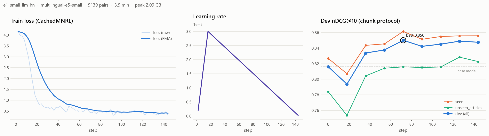
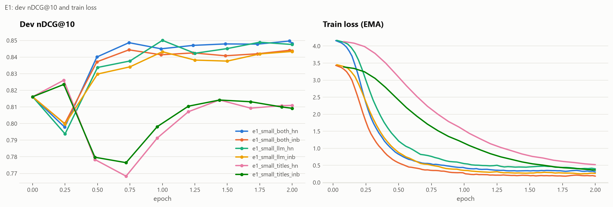

# ru-law-retrieval

Бенчмарк поиска по законам РФ и дообученная маленькая модель эмбеддингов.

**Вопрос исследования.** Насколько дешёвое доменное дообучение маленькой модели эмбеддингов на синтетических вопросах (минуты на одной RTX 3070) приближает её к большим моделям в поиске статей законов РФ? И где это ломается: на статьях и кодексах, которых не было в обучении?

**Ответ одной фразой.** 3.9 минуты дообучения `multilingual-e5-small` (118M параметров) поднимают nDCG@10 на тесте с **0.802 до 0.845** (+0.043, 95% ДИ [+0.028; +0.058]). Модель становится статистически неотличима от `multilingual-e5-large` (560M) при задержке в 6.7 раза меньше на CPU. Лучшую модель бенчмарка (FRIDA, 823M; 0.878) догнать не удалось. Источники: [`results/bootstrap.csv`](results/bootstrap.csv), [`results/headline.json`](results/headline.json).


| | Результат | Где смотреть |
|---|---|---|
| Прирост к своей базе | **+0.043** nDCG@10 [+0.028; +0.058], три сида: 0.848 ± 0.004 | [bootstrap.csv](results/bootstrap.csv), [headline.json](results/headline.json) |
| Против e5-large (в 4.8 раза больше) | −0.014 [−0.031; +0.003], разница незначима | [bootstrap.csv](results/bootstrap.csv) |
| Против лучшей модели (FRIDA) | −0.034 [−0.052; −0.015], значимо хуже | [bootstrap.csv](results/bootstrap.csv) |
| Статьи, которых не было в обучении | прирост сохраняется: **+0.055** [+0.028; +0.085] | срез `unseen_articles` |
| Кодексы, которых не было в обучении | прирост пропадает: +0.021 [−0.007; +0.049] | срез `unseen_codes` |
| Какие вопросы выигрывают | бытовые: **0.569 → 0.687**; поисковые +0.011; юридические 0 | [qtypes.csv](results/figures/qtypes.csv) |
| Цена по времени | 3.9 мин обучения, пик 2.1 ГБ VRAM; все 14 прогонов за 68 мин | [train_runs.csv](results/train_runs.csv) |
| Цена по общему домену | RuBQ nDCG@10 0.686 → 0.651 | [forgetting.json](results/forgetting.json) |

Опубликовано:
- Датасет: [alekseevpavel04/ru-law-retrieval](https://huggingface.co/datasets/alekseevpavel04/ru-law-retrieval) (формат MTEB).
- Модель: [alekseevpavel04/multilingual-e5-small-ru-law](https://huggingface.co/alekseevpavel04/multilingual-e5-small-ru-law).
- Все решения и их причины: [`docs/DECISIONS.md`](docs/DECISIONS.md).

---

## Содержание

1. [Датасет](#датасет)
2. [Главная таблица](#главная-таблица)
3. [Где помогает дообучение](#где-помогает-дообучение)
4. [Абляции и кривая обучения](#абляции-e1-и-кривая-обучения-e4)
5. [Обучение: кривые](#обучение-кривые)
6. [Гибрид BM25 + dense](#гибрид-bm25--dense-rrf)
7. [Забывание](#забывание-e5)
8. [Скорость и размер](#скорость-и-размер-e6)
9. [Разбор ошибок](#разбор-ошибок)
10. [Ограничения](#ограничения)
11. [Воспроизведение](#воспроизведение)

## Датасет

**Корпус.** 3786 действующих статей шести законов, скачанных с legalacts.ru 19.09.2026. Редакции указаны в `sources.json` датасета.

- **Обучающий домен:** Трудовой кодекс, Гражданский кодекс (все 4 части), Жилищный кодекс, КоАП.
- **Только тест:** Семейный кодекс и Закон «О защите прав потребителей».

Поиск идёт по общему корпусу всех кодексов сразу, так что путаница между кодексами (наём жилья в ЖК против аренды в ГК) тоже часть задачи. Статьи «утратила силу» и пустые исключены. Статистика: [`results/corpus_stats.json`](results/corpus_stats.json).

| Кодекс | Статей | Действующих | Исключено (утр. силу / пустые) | Медиана, симв. | p95, симв. | Медиана, ток. | p95, ток. | > 512 ток. | Фрагментов |
|---|---:|---:|---:|---:|---:|---:|---:|---:|---:|
| ТК (`tk`) | 540 | 534 | 6 / 0 | 1092 | 4785 | 220 | 918 | 97 | 1894 |
| ГК (`gk`) | 1731 | 1717 | 12 / 2 | 862 | 3184 | 186 | 653 | 144 | 4537 |
| ЖК (`zhk`) | 243 | 241 | 2 / 0 | 1696 | 10537 | 335 | 2027 | 78 | 1564 |
| КоАП (`koap`) | 1124 | 1071 | 53 / 0 | 1345 | 6421 | 277 | 1252 | 273 | 5127 |
| СК (`sk`) | 175 | 171 | 4 / 0 | 833 | 2758 | 180 | 604 | 11 | 401 |
| ЗоЗПП (`zozpp`) | 55 | 52 | 3 / 0 | 1704 | 5953 | 342 | 1192 | 19 | 286 |

**Два представления корпуса:**
- **article:** статья целиком с заголовком «Кодекс, Статья N. Название», обрезка на 512 токенах одинакова для всех моделей;
- **chunk:** фрагменты до 600 символов в границах статьи, с перекрытием 90 символов и заголовком статьи в начале.

В протоколе chunk статья получает максимальный score своих фрагментов. Все метрики и разметка считаются на уровне статей.

**Вопросы.** Их генерируют две локальные LLM из разных семейств (llama.cpp, Q4_K_M), чтобы стиль обучающих вопросов не совпадал со стилем теста:
- **train:** Qwen3-8B, 3 вопроса на статью;
- **dev/test:** YandexGPT-5-Lite-8B, 1 вопрос на статью, каждый проверяет LLM-судья (Qwen3-8B).

Типы вопросов:

| Тип | Пример из теста |
|---|---|
| `everyday` | «Я купил бизнес, а там куча проблем: не всё имущество есть, и ещё долги, о которых мне не сказали. Можно ли как-то цену снизить?» |
| `search` | «запрет на посредников при усыновлении» |
| `legal` | «Каков порядок определения размера алиментов на нетрудоспособных совершеннолетних детей при отсутствии соглашения об уплате алиментов?» |

| Сплит | Вопросов | Комментарий |
|---|---:|---|
| train | 9 139 | и 3 159 бесплатных пар «название статьи → текст» для абляции |
| dev | 296 | только выбор чекпоинтов и гиперпараметров |
| test | 728 | срезы: `seen` 293, `unseen_articles` 218, `unseen_codes` 217 |
| golden | 174 | подмножество test с повторной разметкой и множественной релевантностью |

Срезы теста:
- `seen`: по этим статьям были обучающие вопросы, но сами вопросы другие;
- `unseen_articles`: 10% статей обучающих кодексов, отложенных без обучающих вопросов;
- `unseen_codes`: кодексы, которых не было в обучении.

Статьи dev и test не пересекаются. Утечки проверяют тесты `tests/test_leaks.py`. Сколько вопросов отсеял каждый фильтр, записано в [`results/dataset_stats.json`](results/dataset_stats.json): длина, ссылки на номер статьи, копирование фраз, дубли, почти-дубли, судья.

**Golden.** Это 180 тестовых вопросов, по 20 на каждую пару «срез × тип». Для каждого есть эталон и 5 кандидатов из выдачи BM25 и FRIDA. Разметку по просьбе автора проекта выполнил ИИ-агент (Claude Opus 5, 6 независимых экземпляров по 30 вопросов) по инструкции [`docs/GOLDEN_GUIDE.md`](docs/GOLDEN_GUIDE.md). Это не юрист. Интерфейс для ручной перепроверки: `python -m rlr annotate`.

Итог ([`results/golden_stats.json`](results/golden_stats.json)):
- эталон релевантен в 98.3% случаев;
- 15 вопросов исправлено, 6 выброшено;
- **у 21% вопросов нашлась ещё одна релевантная статья.**

Значит, синтетическая разметка «вопрос → одна статья» неполна примерно для каждого пятого вопроса. Это отдельный результат: он показывает, насколько шумна авторазметка.

**Насколько тест «лексический».** Доля слов вопроса (после стемминга), которые есть в эталонной статье ([`results/lexical_overlap.csv`](results/lexical_overlap.csv)):

| Тип | Доля слов из статьи |
|---|---:|
| `search` | 0.91 |
| `legal` | 0.75 |
| `everyday` | 0.28 |

BM25 заметно отстаёт от dense-моделей (0.670 против 0.80-0.88), так что тест не сводится к совпадению слов.

## Главная таблица

Test, протокол chunk, nDCG@10 на уровне статей. В скобках 95% бутстрап-ДИ по запросам (10 000 ресэмплов). Жирным выделены дообученные модели (seed 42, конфигурации выбраны только по dev). Источник: [`results/main_table.csv`](results/main_table.csv).


| Модель | Параметры, M | nDCG@10 [95% ДИ] | Recall@10 | seen | unseen_articles | unseen_codes |
|---|---:|---:|---:|---:|---:|---:|
| FRIDA | 823 | 0.878 [0.859; 0.896] | 0.964 | 0.874 | 0.873 | 0.890 |
| e5-large-instruct | 560 | 0.865 [0.846; 0.883] | 0.968 | 0.866 | 0.860 | 0.868 |
| e5-large | 560 | 0.859 [0.839; 0.877] | 0.959 | 0.867 | 0.845 | 0.861 |
| bge-m3 | 568 | 0.856 [0.836; 0.875] | 0.957 | 0.853 | 0.845 | 0.872 |
| **ft-e5-base** | 278 | 0.847 [0.826; 0.866] | 0.953 | 0.844 | 0.858 | 0.839 |
| USER-bge-m3 | 359 | 0.846 [0.825; 0.866] | 0.952 | 0.851 | 0.831 | 0.853 |
| **ft-e5-small** | 118 | 0.845 [0.824; 0.864] | 0.948 | 0.835 | 0.845 | 0.858 |
| Qwen3-Emb-0.6B | 596 | 0.843 [0.823; 0.863] | 0.953 | 0.834 | 0.840 | 0.859 |
| ru-en-RoSBERTa | 405 | 0.840 [0.819; 0.859] | 0.956 | 0.844 | 0.837 | 0.837 |
| USER2-base | 149 | 0.825 [0.804; 0.846] | 0.945 | 0.825 | 0.815 | 0.837 |
| e5-base | 278 | 0.822 [0.800; 0.843] | 0.934 | 0.810 | 0.799 | 0.860 |
| e5-small | 118 | 0.802 [0.778; 0.826] | 0.905 | 0.785 | 0.789 | 0.837 |
| RRF(BM25+FRIDA) | | 0.792 [0.767; 0.815] | 0.911 | 0.807 | 0.758 | 0.804 |
| RRF(BM25+ft-e5-small) | | 0.772 [0.747; 0.796] | 0.894 | 0.785 | 0.751 | 0.776 |
| USER-base | 124 | 0.684 [0.656; 0.710] | 0.845 | 0.674 | 0.671 | 0.710 |
| BM25 | | 0.670 [0.640; 0.700] | 0.776 | 0.679 | 0.640 | 0.689 |
| rubert-tiny2 | 29 | 0.405 [0.376; 0.434] | 0.588 | 0.395 | 0.343 | 0.481 |

**Три сида** (42, 43, 44), среднее ± std ([`results/headline.json`](results/headline.json)):

| Модель | test nDCG@10 | golden nDCG@10 |
|---|---|---|
| ft-e5-small | 0.848 ± 0.004 | 0.870 ± 0.002 |
| ft-e5-base | 0.849 ± 0.003 | 0.877 ± 0.004 |

После дообучения e5-base (278M) не лучше e5-small (118M): в этом домене доменные данные важнее размера.

**Значимость.** Парный бутстрап, test/chunk ([`results/bootstrap.csv`](results/bootstrap.csv)). Жирным выделены интервалы, не содержащие ноль. На срезах из 217-293 вопросов ДИ широкие (около ±0.03): разницу меньше ~0.03 там не различить, и это важно при чтении таблицы.

| Сравнение | Все | seen | unseen_articles | unseen_codes |
|---|---:|---:|---:|---:|
| ft-e5-small − e5-small | **+0.043** [+0.028; +0.058] | **+0.050** [+0.026; +0.075] | **+0.055** [+0.028; +0.085] | +0.021 [−0.007; +0.049] |
| ft-e5-small − e5-large | −0.014 [−0.031; +0.003] | **−0.032** [−0.061; −0.003] | −0.001 [−0.033; +0.030] | −0.003 [−0.032; +0.026] |
| ft-e5-small − FRIDA | **−0.034** [−0.052; −0.015] | **−0.039** [−0.068; −0.010] | −0.029 [−0.065; +0.006] | −0.032 [−0.065; +0.002] |
| ft-e5-base − e5-base | **+0.025** [+0.008; +0.041] | **+0.033** [+0.008; +0.059] | **+0.059** [+0.027; +0.092] | −0.021 [−0.049; +0.007] |

**Golden** (174 вопроса, множественная релевантность): ft-e5-small 0.869 [0.831; 0.904] против 0.831 у базы, прирост +0.038 [+0.009; +0.069]. Для сравнения: FRIDA 0.916, e5-large 0.907. Все модели на golden: [график](results/figures/models_golden_chunk.png), [таблица](results/readme_tables.md#golden).

**Два протокола.** Протокол article обрезает 16% статей на 512 токенах, и у всех dense-моделей, кроме USER-base, nDCG@10 в нём ниже, чем в chunk (например, e5-small 0.757 против 0.802). Прирост от дообучения сохраняется и в article: 0.757 → 0.805, +0.048 [+0.031; +0.065]. Все модели: [график](results/figures/models_test_article.png), [таблица](results/readme_tables.md#protocols).

## Где помогает дообучение


| test nDCG@10 | everyday | search | legal |
|---|---:|---:|---:|
| BM25 | 0.265 | 0.822 | 0.922 |
| e5-small | 0.569 | 0.896 | 0.939 |
| **ft-e5-small** | **0.687** | 0.907 | 0.939 |
| e5-large | 0.717 | 0.914 | 0.945 |
| FRIDA | 0.764 | 0.936 | 0.935 |

Вопросы с юридическими терминами почти одинаково хорошо решают все модели, даже BM25. Вся разница между моделями, а с ней и весь выигрыш от дообучения, сосредоточена в бытовых вопросах: модель учится переводить «меня уволили, пока я был на больничном» в «расторжение трудового договора по инициативе работодателя». Источник: [`results/figures/qtypes.csv`](results/figures/qtypes.csv), по кодексам: [`codes.csv`](results/figures/codes.csv).


Срез `unseen_codes` оказался самым простым для базовых моделей: СК и ЗоЗПП тематически обособлены от остального корпуса. Поэтому дообучению там почти некуда расти.

## Абляции (E1) и кривая обучения (E4)

Конфигурации выбирались только по dev, тест приведён для полноты ([`results/ablation.csv`](results/ablation.csv)).

| e5-small: данные × негативы | dev | test |
|---|---:|---:|
| без дообучения | 0.815 | 0.802 |
| заголовки статей, in-batch | 0.822 | 0.803 |
| заголовки статей, + hard negative | 0.826 | 0.804 |
| LLM-вопросы, in-batch | 0.841 | 0.847 |
| **LLM-вопросы, + hard negative** (выбрана по dev) | **0.851** | 0.845 |
| оба источника, in-batch | 0.845 | 0.839 |
| оба источника, + hard negative | 0.848 | 0.845 |

**Нужна ли LLM-генерация?** Да. Бесплатные пары «название статьи → текст» ничего не дают на тесте (0.803 против 0.802), а при долгом обучении модель на них деградирует ниже исходной. LLM-вопросы дают +0.04.

**Нужны ли hard negatives?** На dev они давали от +0.003 до +0.010, на тесте эффект в пределах шума (0.845 против 0.847). Честный вывод: на таком объёме данных они не нужны. Майнинг сделан своим алгоритмом: фрагменты эталонной статьи исключаются из кандидатов в негативы. Почему пришлось добавить фолбэк, объяснено в [DECISIONS.md](docs/DECISIONS.md#6-обучение).


**Кривая обучения.** Число вопросов: 0 → 2 285 → 4 570 → 9 139. Dev растёт 0.815 → 0.832 → 0.838 → 0.851, test 0.802 → 0.811 → 0.835 → 0.845. Плато кривая не достигла, так что больше вопросов, скорее всего, даст ещё прирост ([`learning_curve.csv`](results/figures/learning_curve.csv)).

## Обучение: кривые

- **Лосс и оптимизатор:** `CachedMultipleNegativesRankingLoss` (GradCache: батч 128, в памяти мини-батч 32), bf16, таблица эмбеддингов словаря заморожена.
- **Сэмплер:** свой, не допускает в одном батче две строки про одну статью, чтобы в негативы не попадали фрагменты «своей» статьи.
- **Выбор чекпоинта:** dev оценивается каждые 1/4 эпохи тем же кодом метрик, что и финальная оценка; сохраняется лучший.

Финальная модель:



Все шесть прогонов E1 на одном графике:



Графики всех 14 прогонов лежат в [`results/figures/train/`](results/figures/train/), сырые кривые (loss, lr, grad norm каждые 2 шага; dev по срезам каждые 1/4 эпохи) в [`results/train/curves/`](results/train/curves/). Сводка прогонов с временем и пиковой памятью: [`results/train_runs.csv`](results/train_runs.csv), таблица: [readme_tables.md](results/readme_tables.md#training-runs).

## Гибрид BM25 + dense (RRF)

Это отрицательный результат. Равновесный RRF (k=60) ухудшает обе модели: FRIDA 0.878 → 0.792, ft-e5-small 0.845 → 0.772. BM25 здесь намного слабее dense-моделей (0.670), особенно на бытовых вопросах (0.265), и слияние тянет выдачу вниз. Гибрид имеет смысл пробовать только с весами, подобранными на dev, или с реранкером поверх.

## Забывание (E5)

MTEB `RuBQRetrieval` (общие вопросы по Википедии), nDCG@10, те же префиксы ([`results/forgetting.json`](results/forgetting.json)):

| Модель | до | после | Δ |
|---|---:|---:|---:|
| e5-small | 0.686 | 0.651 | −0.035 |
| e5-base | 0.695 | 0.632 | −0.063 |

Доменная модель платит за специализацию. Если в том же сервисе нужен и общий поиск, стоит держать исходную модель или подмешивать в обучение общие пары.

## Скорость и размер (E6)

Задержка одного запроса включает кодирование и точный поиск по 13 809 фрагментам. CPU: Ryzen 5 5600X, 6 потоков, fp32. GPU: RTX 3070, fp16. Источник: [`results/speed.json`](results/speed.json).


| Модель | Параметры, M | dim | Индекс, МБ (fp32) | CPU p50, мс | GPU p50, мс | test nDCG@10 |
|---|---:|---:|---:|---:|---:|---:|
| **ft-e5-small** | 118 | 384 | 20.2 | 21.7 | 13.5 | 0.845 |
| e5-base | 278 | 768 | 40.5 | 45.6 | 15.9 | 0.822 |
| USER2-base | 149 | 768 | 40.5 | 60.4 | 26.5 | 0.825 |
| bge-m3 | 568 | 1024 | 53.9 | 140.4 | 26.5 | 0.856 |
| e5-large | 560 | 1024 | 53.9 | 145.2 | 27.0 | 0.859 |
| FRIDA | 823 | 1536 | 80.9 | 272.2 | 45.9 | 0.878 |
| Qwen3-Emb-0.6B | 596 | 1024 | 53.9 | 326.9 | 66.9 | 0.843 |

По сравнению с e5-large у дообученной e5-small:
- задержка на CPU в 6.7 раза меньше;
- индекс в 2.7 раза меньше;
- параметров в 4.8 раза меньше.

Качество на тесте при этом статистически неотличимо. Отношения посчитаны в [`results/headline.json`](results/headline.json).

## Разбор ошибок

30 худших запросов ft-e5-small на golden классифицировал ИИ-агент по текстам статей ([`results/error_analysis.csv`](results/error_analysis.csv)):

| Категория | Число |
|---|---:|
| соседняя статья той же главы (общая норма вместо специальной и т.п.) | 12 |
| тот же кодекс, другая глава | 7 |
| другой кодекс | 4 |
| разметка неполна: выданная статья тоже отвечает | 3 |
| бытовая формулировка не связана с юридическим термином | 3 |
| вопрос неоднозначен | 1 |

Нужную область права модель находит почти всегда: в 19 случаях из 30 она остаётся в правильном кодексе. Главная слабость в том, что соседние статьи одной главы плохо различаются. Характерные примеры:

- **Соседняя статья.** Запрос «условия управления личным фондом». Первой модель выдала ГК ст. 123.20-7 «Управление личным фондом», а нужная ст. 123.20-5 «Условия управления личным фондом» оказалась второй.
- **Другой кодекс.** «Я брал кредит, мне звонят коллекторы и угрожают. Могут ли они так себя вести?» Слово «кредит» увело модель в ГК (ст. 324), а нужна КоАП ст. 14.57 о нарушениях при возврате просроченной задолженности.
- **Бытовая формулировка.** «Какой-то тип начал дёргать цены акций, чтобы навариться. Что ему за это будет?» Модель не связала это с «манипулированием рынком» (КоАП ст. 15.30 только на 36-м месте) и выдала статью о приобретении крупных пакетов акций.
- **Неполная разметка.** Вопрос о сроке ответа на запрос по заявке на географическое указание. Модель выдала ГК ст. 1527 «Отзыв заявки», где прямо сказано, что заявку отзывают, если материалы не представлены в срок. Это тоже правильный ответ.

## Ограничения

- **Синтетические вопросы.** Реальные вопросы длиннее, грязнее и неоднозначнее. Два генератора из разных семейств снижают риск общего «LLM-стиля», но не убирают его.
- **Неполная разметка.** Примерно у 21% вопросов больше одной релевантной статьи (оценка по golden). Метрики на автотесте занижают модели, которые находят другую, но тоже правильную статью.
- **Golden размечен ИИ-агентом, а не юристом.**
- **Одна редакция законов** (сентябрь 2026). Статьи, утратившие силу, исключены.
- **Протокол article** обрезает 16% статей на 512 токенах.
- **Шум сидов.** Разброс по сидам (std 0.003-0.004 на тесте) сопоставим с разницей между многими моделями в середине таблицы.
- **Внешний набор tk-rf-rag** (25 вопросов по ТК) упирается в потолок: Recall@5 = 1.0 у всех dense-моделей, поэтому сравнивать модели на нём нельзя.
- **Результат USER-base аномально низкий.** Эта DeBERTa-модель в transformers 5 не работает в fp16 и не загружается штатным кодом sentence-transformers 6. Её пришлось собрать из модулей вручную и оценить в fp32, при этом sanity-тест префиксов она проходит. Возможна регрессия в библиотеке, так что к её цифре стоит относиться осторожно.

## Воспроизведение

Windows 11, Python 3.11, RTX 3070 8 ГБ. Время шагов измерено на этой машине.

```bash
uv venv .venv --python 3.11
uv pip install -r requirements.txt && uv pip install -e .
cp .env.example .env                          # кэши HF / pip / mteb на диске D

python -m rlr download                         # ~15 мин (ГК-4 и СК постатейно, пауза 0.4 с)
python -m rlr parse && python -m rlr chunk     # ~1 мин
python -m rlr splits                           # фиксирует разбиения (seed 42), повторно без --force не перезапишет

scripts/llm_server.sh yandex 3 &               # портативный llama.cpp + YandexGPT-5-Lite-8B Q4_K_M
python -m rlr generate --mode eval --out data/gen/eval_raw.jsonl   # dev/test: 6 мин
scripts/run_generation.sh                      # Qwen3-8B: судья (5 мин) + train-вопросы (41 мин)
python -m rlr build-dataset                    # фильтры, дедуп, позитивы (1 мин)

python -m rlr baselines --bm25 --sets dev test external   # E0: ~25 мин на 12 моделей
python -m rlr mine --base intfloat/multilingual-e5-small --name e5-small   # 1 мин
scripts/run_grid.sh configs/train/e1_*.yaml    # E1: 6 прогонов, 21 мин обучения
python -m rlr train configs/train/e1_small_llm_hn.yaml    # финальная модель: 3.9 мин, пик 2.1 ГБ
scripts/run_e3.sh                              # E3: сиды 43, 44
scripts/run_final_eval.sh                      # тест, golden, гибриды, бутстрап
scripts/run_e5_e6.sh                           # E5 RuBQ (~1.5 мин на модель) и E6 скорость
python -m rlr analysis report ...              # таблицы и графики (команды в scripts/)
python -m pytest                               # 71 быстрый тест; -m slow: ещё 12 sanity-тестов префиксов моделей
```

Всё обучение (14 прогонов E1-E4) заняло 68 минут GPU, пиковая память 3.55 ГБ (e5-base).

## Связь с tk-rf-rag

Исследование выросло из RAG-сервиса по Трудовому кодексу [tk-rf-rag](https://github.com/alekseevpavel04/tk-rf-rag). Оттуда взяты скачивание, парсер (с исправленными багами номеров `22.1` и `341.1-1`) и разбиение на фрагменты. Дообученная модель затем внедрена обратно в сервис, результат «было/стало» описан в его README.

## Структура

```
configs/     кодексы, модели и промпты (baselines.yaml), обучение (train/*.yaml), пары для бутстрапа
src/rlr/     data/      скачивание, парсинг, фрагменты, сплиты, сборка, экспорт в MTEB
             gen/       LLM-генерация, фильтры, судья
             train/     майнинг негативов, сэмплер без ложных негативов, обучение, dev-evaluator
             eval/      метрики, поиск (dense / BM25 / RRF), бутстрап, скорость, забывание, анализ
             annotate/  интерфейс разметки golden (FastAPI + одна HTML-страница)
tests/       парсер, фрагменты, метрики, фильтры, утечки, префиксы моделей, сэмплер, майнинг, бутстрап
results/     все числа и графики (коммитятся), per-query метрики для бутстрапа
docs/        DECISIONS.md, DATASET_CARD.md, MODEL_CARD.md, GOLDEN_GUIDE.md, CV_NOTES.md
```

Лицензия кода: MIT. Лицензии данных указаны в [карточке датасета](docs/DATASET_CARD.md).
